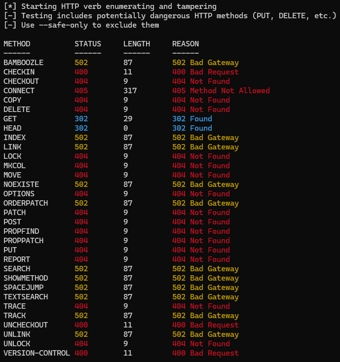

# GoHTTPProbe

GoHTTPProbe is a modern HTTP methods testing tool written in Go. It allows you to test various HTTP methods against a URL to discover HTTP verb tampering vulnerabilities and "dangerous" HTTP methods.

This tool is a reimplementation of the Python [HTTPMethods](https://github.com/ShutdownRepo/httpmethods) utility, as there were difficulties getting it to work in modern python environments and because I just like go :)

## Features

- Test multiple HTTP methods against target URLs
- Detect supported and potentially dangerous HTTP methods
- Automatic discovery of server-supported methods via OPTIONS request
- Concurrent request handling for fast results
- Support for custom headers and cookies
- Option to read target URLs from a file
- JSON export for results
- Low dependencies and simple installation

## Installation

If you have Go installed, you may use:

```sh
go install github.com/byte/gohttpprobe/cmd/ghp@latest
```

### From Source

```sh
# Clone the repository
git clone https://github.com/ByteSizedMarius/GoHTTPProbe
cd GoHTTPProbe

# Option 1: Build the binary
go build -o ghp ./cmd/ghp
# This builds a binary named 'ghp' in the current directory

# Option 2: Install to your GOPATH/bin
go install ./cmd/ghp
# This installs the binary named 'ghp' to your GOPATH/bin directory
```

## Usage

**Basic usage:**

```sh
ghp -u example.com
```

If no protocol is specified, `https://` is used.

**Full options:**

```
[~] GoHTTPProbe - HTTP Methods Tester v0.0.1

Usage: ghp -u URL [options]

Options:
  # Target selection:
  -u, --url string         Target URL (e.g., https://example.com:port/path)
  -i, --input string       Read target URLs from a file (one per line)

  # Output control:
  -v, --verbose            Enable verbose output
  -q, --quiet              Show no information at all
  -o, --output string      Save results to specified JSON file

  # Connection options:
  -k, --insecure           Allow insecure server connections (skip SSL verification)
  -f, --follow             Follow redirects
  -p, --proxy string       Use proxy for connections (e.g., http://localhost:8080)
  -n, --concurrent int     Number of concurrent requests (default: 5)
  -t, --timeout int        Timeout in seconds for HTTP requests (default: 10)

  # Request customization:
  -H, --header strings     Headers to include (e.g., -H "User-Agent: test" or -H headers.txt)
  -b, --cookies string     Cookies to use (e.g., -b "session=abc" or -b cookies.txt)
  -c, --cookie-jar string  Write received cookies to specified file
  -A, --user-agent string  User-Agent string to send

  # Method testing options:
  -s, --safe-only          Only test safe methods (exclude PUT, DELETE, etc.)
  -m, --methods string     Custom HTTP methods wordlist file
```



### Examples

Test a single URL:
```sh
ghp -u example.com
```

Test with custom headers:
```sh
ghp -u example.com -H "User-Agent: MyCustomAgent" -H "Authorization: Bearer token123"
```

Test with headers from a file:
```sh
ghp -u example.com -H headers.txt
```

Test with cookies:
```sh
ghp -u example.com -b "session=abc123; token=xyz456"
```

Test multiple URLs from a file:
```sh
ghp -i urls.txt
```

Save results to JSON:
```sh
ghp -u example.com -o results.json
```

Only test safe methods:
```sh
ghp -u example.com --safe-only
```

Use custom HTTP methods list:
```sh
ghp -u example.com -m custom-methods.txt
```

Set concurrency level for faster testing:
```sh
ghp -u example.com -n 10
```

## Attribution

This project is based on the [HTTPMethods](https://github.com/ShutdownRepo/httpmethods) Python utility by ShutdownRepo.

## Notes

### Terminal Colors

The tool uses ANSI escape sequences for colorized output in the terminal:
- Green: 200 OK responses
- Cyan: 3xx redirection responses
- Red: 4xx client error responses
- Yellow: 5xx server error responses

Colors may not display correctly in all terminals, particularly on Windows command prompt. Consider using a terminal that supports ANSI colors like Windows Terminal, PowerShell, or WSL.

### Default Wordlist

The tool includes a default wordlist of HTTP methods to test located at `wordlists/default.txt`. You can specify your own wordlist using the `-m` flag.

### OPTIONS Request

By default, the tool sends an OPTIONS request to the target server to discover additional supported HTTP methods, which are then added to the test list. This helps in finding methods that might not be in the default wordlist but are supported by the server.

### Dangerous Methods

By default, the tool tests all HTTP methods, including potentially dangerous ones like PUT, DELETE, etc. These methods could modify server content if the server allows them. Use the `--safe-only` flag to exclude these methods from testing.

The following methods are considered potentially dangerous:
- DELETE - Can delete resources on the server
- PUT - Can create or replace resources on the server
- PATCH - Can modify resources on the server
- COPY - Can copy resources on the server
- UNCHECKOUT - Can affect version control on the server

### Method Selection

The default list of HTTP methods tested is based on the original Python implementation, with some common methods that might be useful for security testing. Alternative wordlists are available:

- Default wordlist: `wordlists/default.txt`
- Burp Suite methods: `wordlists/burp.txt` - A more comprehensive list of methods used by Burp Suite

You can use these wordlists with the `-m` flag:

```sh
ghp -u example.com -m wordlists/burp.txt
```

You can also create your own custom wordlist file with HTTP methods and use it with the `-m` flag.

## Development

### Running Tests

Run all tests:
```sh
go test ./...
```

Run tests with verbose output:
```sh
go test -v ./...
```

Check test coverage:
```sh
go test -cover ./...
```

Generate a detailed coverage report:
```sh
go test -coverprofile=coverage.out ./...
go tool cover -html=coverage.out
```

## License

MIT License